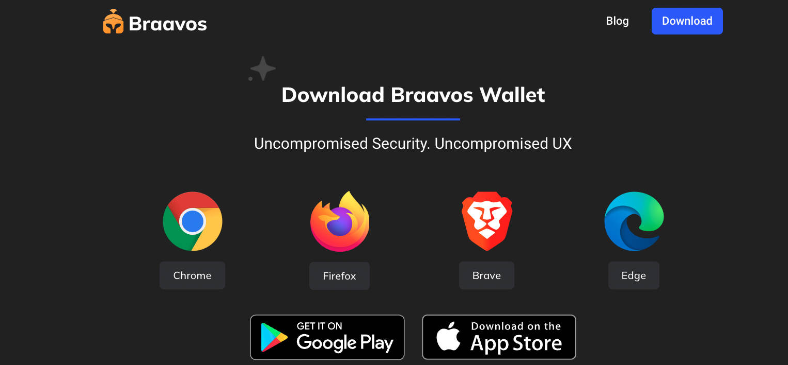
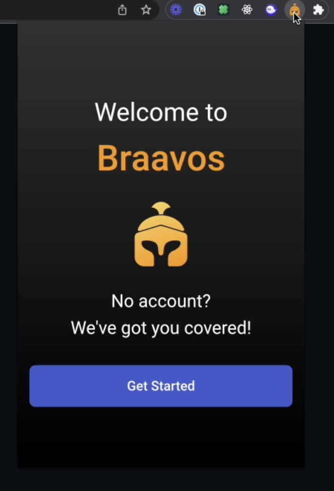
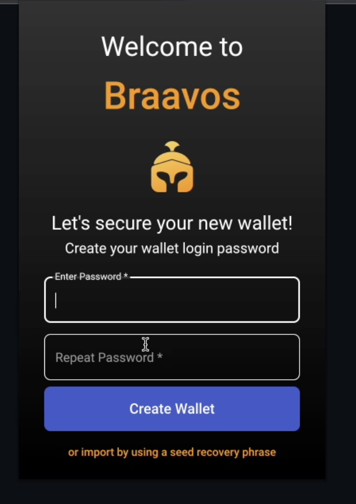
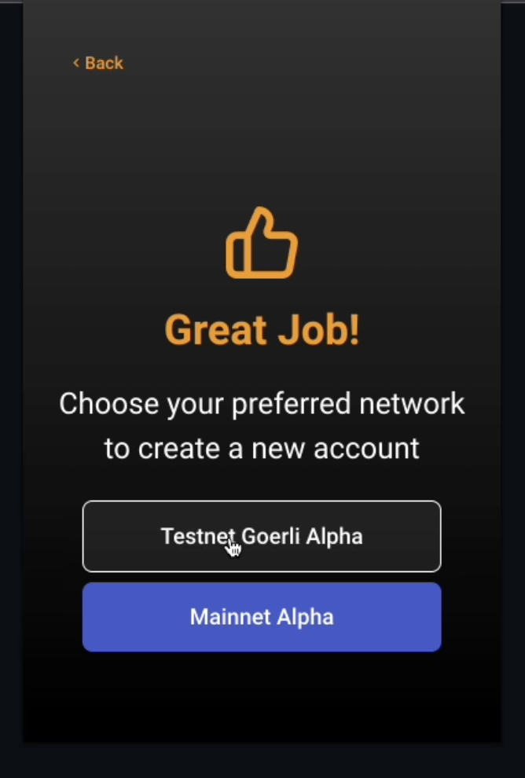
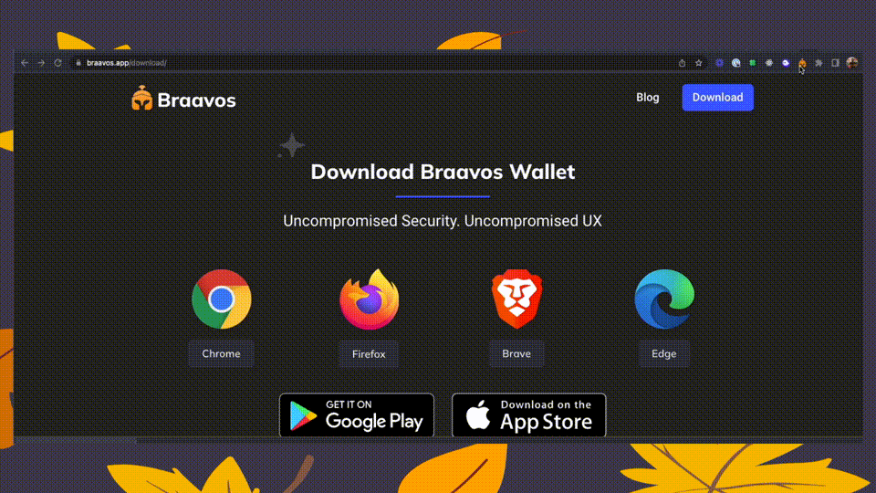
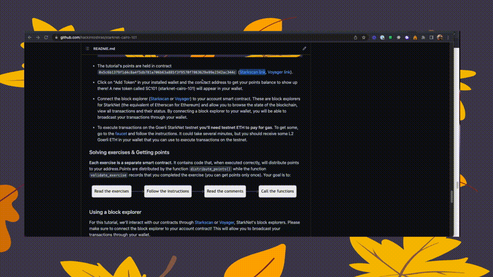
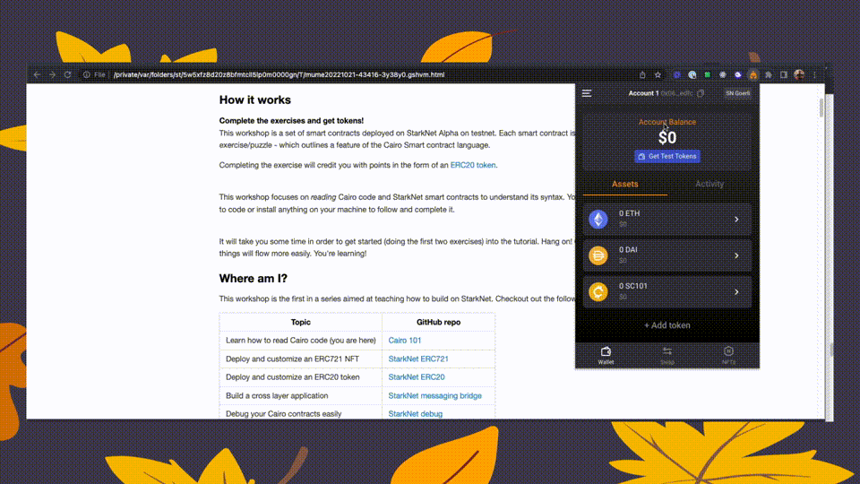

# StarkNet Cairo 101

**Get started with Cairo with this simple tutorial.
Complete the puzzles/exercises, get tokens and learn about StarkNet smart contracts!**

## Introduction​

### Disclaimer
​Don't expect any benefit from using this other than learning some cool stuff about StarkNet, the first general-purpose validity rollup on the Ethereum mainnnet.

​StarkNet is still in Alpha. This means that development is ongoing, and the paint is not dry everywhere. Things will get better, and in the meanwhile, we make things work with a bit of duct tape here and there!​


### How it works
**Complete the exercises and get tokens!**
This workshop is a set of smart contracts deployed on StarkNet Alpha on testnet. Each smart contract is an exercise/puzzle - which outlines a feature of the Cairo Smart contract language.

Completing the exercise will credit you with points in the form of an [ERC20 token](contracts/token/TDERC20.cairo).

​
This workshop focuses on *reading* Cairo code and StarkNet smart contracts to understand their syntax. You do not need to code or install anything on your machine to follow and complete it.​

​
It will take you some time in order to get started (doing the first two exercises) in the tutorial. Hang on! Once there, things will flow more easily. You're learning!​

### Where am I?

This workshop is the first in a series aimed at teaching how to build on StarkNet. Checkout out the following:

| Topic | GitHub repo |
| ------------------------------------------- | -------------------------------------------------------------------------------------- |
| Learn how to read Cairo code (you are here) | [Cairo 101](https://github.com/starknet-edu/starknet-cairo-101) |
| Deploy and customize an ERC721 NFT | [StarkNet ERC721](https://github.com/starknet-edu/starknet-erc721) |
| Deploy and customize an ERC20 token | [StarkNet ERC20](https://github.com/starknet-edu/starknet-erc20) |
| Build a cross-layer application | [StarkNet messaging bridge](https://github.com/starknet-edu/starknet-messaging-bridge) |
| Debug your Cairo contracts easily | [StarkNet debug](https://github.com/starknet-edu/starknet-debug) |
| Design your own account contract | [StarkNet account abstraction](https://github.com/starknet-edu/starknet-accounts) |

### Providing feedback & getting help

Once you are done working on this tutorial, your feedback would be greatly appreciated!

**Please fill out [this form](https://forms.reform.app/starkware/untitled-form-4/kaes2e) to let us know what we can do to make it better.**

​
And if you struggle to move forward, do let us know! This workshop is meant to be as accessible as possible; we want to know if it's not the case.

​
Do you have a question? Join our [Discord server](https://starknet.io/discord), register, and join channel #tutorials-support.

Are you interested in following online workshops about learning how to dev on StarkNet? [Subscribe here](http://eepurl.com/hFnpQ5)

### Contributing

This project can be made better and will evolve as StarkNet matures. Your contributions are welcome! Here are things that you can do to help:

- Create a branch with a translation to your language
- Correct bugs if you find some
- Add an explanation in the comments of the exercise if you feel it needs more explanation
- Add exercises showcasing your favorite Cairo feature

### Languages

- A Spanish version is available [here](https://github.com/starknet-edu/starknet-cairo-101/tree/spanish).
- A Portuguese version is available [here](./README.pt.md).
- A Korean version is available [here](./README.kr.md).

## Getting started

### Creating and setting up a smart contract wallet

**To complete the tutorial you need to collect points.** These points will be owned by a smart contract wallet you need to deploy.

- The easiest way to set one up is to use Argent X ([download the chrome extension](https://chrome.google.com/webstore/detail/argent-x-starknet-wallet/dlcobpjiigpikoobohmabehhmhfoodbb/) or [check their repo](https://github.com/argentlabs/argent-x)) or Braavos ([download the chrome extension](https://chrome.google.com/webstore/detail/braavos-wallet/jnlgamecbpmbajjfhmmmlhejkemejdma)). These wallet solutions are similar to what Metamask is for Ethereum and allow users to initiate transactions and interact with applications on StarkNet.
- Here are the steps to install the Braavos extension
- **Step 1**

Visit the [braavos download page](https://braavos.app/download/) and install the appropriate extension for the browser. Braavos also come with Android and IOS apps.

- **Step 2**

Click on the extension on your browser, open the extension dropdown opens up, and click on Get Started to start the installation.

- **Step 3**

Create a wallet login password and keep it safe.

- **Step 4**

Copy the autogenerated secret recovery phrases and keep them safe. You might need it to recover your account and its assets in the future. Do not share the password or the recovery phrase with anyone

- **Step 5**

Make sure to connect to the Goerli testnet network.

- **Step 6**

Get yourself a coffee, your account deployment begins, it may take up to 5 minutes. As expected, the account balance will be zero for a new account.


- The new account which you just created is a smart contract account. Please note that in StarkNet there is only one type of account - smart contract accounts (this is called Account Abstraction), in contrast to Ethereum where there are wallets and smart contracts.
- In other words, every wallet on StarkNet is a smart contract and there is no distinction between them and other smart contracts. The wallet extension automatically deploys a transaction you need that publishes your smart contract wallet to the network. You can view this transaction in the activity of your wallet. On clicking the activity, it redirects to https://testnet.starkscan.co/ where you view the details of the transaction.


- Smart contracts on Starknet can be used to create and hold new special-purpose tokens. For the purpose of the tutorial, we've created a token called SC-101 (starknet-cairo-101) to use for tutorial points. - The token is deployed using a contract with address `0x5c6b1379f1d4c8a4f5db781a706b63a885f3f9570f7863629e99e2342ac344c` ([Starkscan link](https://testnet.starkscan.co/contract/0x05c6b1379f1d4c8a4f5db781a706b63a885f3f9570f7863629e99e2342ac344c), [Voyager link](https://goerli.voyager.online/contract/0x5c6b1379f1d4c8a4f5db781a706b63a885f3f9570f7863629e99e2342ac344c)).
- Your next step is to add the SC101 token to your newly installed wallet using the contract address `0x5c6b1379f1d4c8a4f5db781a706b63a885f3f9570f7863629e99e2342ac344c`.
Click on "Add Token", copy the contract address, and enter the token address to add the token. A new token called SC101 (starknet-cairo-101) will appear in your wallet.


- You can track all of the account/wallet using the activity with the help of the block explorer ([Starkscan](https://testnet.starkscan.co/) or [Voyager](https://goerli.voyager.online/)). These are block explorers for StarkNet (the equivalent of Etherscan for Ethereum) and allow you to browse the state of the blockchain, and view all transactions and their status. Here's how you can view your account on Starkscan.


- To execute transactions on the Goerli StarkNet testnet **you'll need testnet ETH to pay for gas**. To get some, go to the [faucet](https://faucet.goerli.starknet.io/) and follow the instructions. It could take several minutes, but you should receive some L2 Goerli ETH in your wallet that you can use to execute transactions on the testnet.

### Solving exercises & Getting points​

​
**Each exercise is a separate smart contract.** It contains code that, when executed correctly, will distribute points to your address.
​
Points are distributed by the function `distribute_points()` while the function `validate_exercise` records that you completed the exercise (you can get points only once). Your goal is to:


​
​
### Using a block explorer

For this tutorial, we'll interact with our contracts through [Starkscan](https://testnet.starkscan.co/) or [Voyager](https://goerli.voyager.online/), StarkNet's block explorers. Please make sure to connect the block explorer to your account contract! This will allow you to broadcast your transactions through your wallet.

When looking for a contract/transaction, always ensure you are on the Goerli version of the block explorer!

- Access your transactions with a URL of the format:
- [https://testnet.starkscan.co/tx/your-tx-hash](https://testnet.starkscan.co/tx/your-tx-hash).
- [https://goerli.voyager.online/tx/your-tx-hash](https://goerli.voyager.online/tx/your-tx-hash).
- Access a contract with a URL of the format:
- [https://testnet.starkscan.co/contract/your-contract-address](https://testnet.starkscan.co/contract/your-contract-address)
- [https://goerli.voyager.online/contract/your-contract-address](https://goerli.voyager.online/contract/your-contract-address)
- Access read/write functions of the contract with the "read/write contract" tab in the block explorer.

​
​

## Addresses of the exercises and contracts

| Topic | Contract code | Contract on Starkscan | Contract on Voyager |
| ------------------------------------- | ----------------------------------------------------- | ---------------------------------------------------------------------------------------------------------------- | ---------------------------------------------------------------------------------------------------------------- |
| Points counter ERC20 | [Points counter ERC20](contracts/token/TDERC20.cairo) | [Link](https://testnet.starkscan.co/contract/0x5c6b1379f1d4c8a4f5db781a706b63a885f3f9570f7863629e99e2342ac344c) | [Link](https://goerli.voyager.online/contract/0x5c6b1379f1d4c8a4f5db781a706b63a885f3f9570f7863629e99e2342ac344c) |
| General syntax | [Ex01](contracts/ex01.cairo) | [Link](https://testnet.starkscan.co/contract/0x29e2801df18d7333da856467c79aa3eb305724db57f386e3456f85d66cbd58b) | [Link](https://goerli.voyager.online/contract/0x29e2801df18d7333da856467c79aa3eb305724db57f386e3456f85d66cbd58b) |
| Storage variables, getters, asserts | [Ex02](contracts/ex02.cairo) | [Link](https://testnet.starkscan.co/contract/0x18ef3fa8b5938a0059fa35ee6a04e314281a3e64724fe094c80e3720931f83f) | [Link](https://goerli.voyager.online/contract/0x18ef3fa8b5938a0059fa35ee6a04e314281a3e64724fe094c80e3720931f83f) |
| Reading and writing storage variables | [Ex03](contracts/ex03.cairo) | [Link](https://testnet.starkscan.co/contract/0x79275e734d50d7122ef37bb939220a44d0b1ad5d8e92be9cdb043d85ec85e24) | [Link](https://goerli.voyager.online/contract/0x79275e734d50d7122ef37bb939220a44d0b1ad5d8e92be9cdb043d85ec85e24) |
| Mappings | [Ex04](contracts/ex04.cairo) | [Link](https://testnet.starkscan.co/contract/0x2cca27cae57e70721d0869327cee5cb58098af4c74c7d046ce69485cd061df1) | [Link](https://goerli.voyager.online/contract/0x2cca27cae57e70721d0869327cee5cb58098af4c74c7d046ce69485cd061df1) |
| Variable visibility | [Ex05](contracts/ex05.cairo) | [Link](https://testnet.starkscan.co/contract/0x399a3fdd57cad7ed2193bdbb00d84553cd449abbdfb62ccd4119eae96f827ad) | [Link](https://goerli.voyager.online/contract/0x399a3fdd57cad7ed2193bdbb00d84553cd449abbdfb62ccd4119eae96f827ad) |
| Functions visibility | [Ex06](contracts/ex06.cairo) | [Link](https://testnet.starkscan.co/contract/0x718ece7af4fb1d9c82f78b7a356910d8c2a8d47d4ac357db27e2c34c2424582) | [Link](https://goerli.voyager.online/contract/0x718ece7af4fb1d9c82f78b7a356910d8c2a8d47d4ac357db27e2c34c2424582) |
| Comparing values | [Ex07](contracts/ex07.cairo) | [Link](https://testnet.starkscan.co/contract/0x3a1ad1cde69c9e7b87d70d2ea910522640063ccfb4875c3e33665f6f41d354a) | [Link](https://goerli.voyager.online/contract/0x3a1ad1cde69c9e7b87d70d2ea910522640063ccfb4875c3e33665f6f41d354a) |
| Recursions level 1 | [Ex08](contracts/ex08.cairo) | [Link](https://testnet.starkscan.co/contract/0x15fa754c386aed6f0472674559b75358cde49db8b2aba8da31697c62001146c) | [Link](https://goerli.voyager.online/contract/0x15fa754c386aed6f0472674559b75358cde49db8b2aba8da31697c62001146c) |
| Recursions level 2 | [Ex09](contracts/ex09.cairo) | [Link](https://testnet.starkscan.co/contract/0x2b9fcc1cfcb1ddf4663c8e7ac48fc87f84c91a8c2b99414c646900bf7ef5549) | [Link](https://goerli.voyager.online/contract/0x2b9fcc1cfcb1ddf4663c8e7ac48fc87f84c91a8c2b99414c646900bf7ef5549) |
| Composability | [Ex10](contracts/ex10.cairo) | [Link](https://testnet.starkscan.co/contract/0x8415762f4b0b0f44e42ac1d103ac93c3ea94450a15bb65b99bbcc816a9388) | [Link](https://goerli.voyager.online/contract/0x8415762f4b0b0f44e42ac1d103ac93c3ea94450a15bb65b99bbcc816a9388) |
| Importing functions | [Ex11](contracts/ex11.cairo) | [Link](https://testnet.starkscan.co/contract/0xab5577b9be8948d89dbdba63370a3de92e72a23c4cacaea38b3a74eec3a872) | [Link](https://goerli.voyager.online/contract/0xab5577b9be8948d89dbdba63370a3de92e72a23c4cacaea38b3a74eec3a872) |
| Events | [Ex12](contracts/ex12.cairo) | [Link](https://testnet.starkscan.co/contract/0x24d15e02ddaa19d7ecd77204d35ed9bfff00a0cabc62eb3da5ba7680e44baf9) | [Link](https://goerli.voyager.online/contract/0x24d15e02ddaa19d7ecd77204d35ed9bfff00a0cabc62eb3da5ba7680e44baf9) |
| Privacy on StarkNet | [Ex13](contracts/ex13.cairo) | [Link](https://testnet.starkscan.co/contract/0x2bae9190076c4252289b8a8671277cef57318192cff20c736808b0c71095895) | [Link](https://goerli.voyager.online/contract/0x2bae9190076c4252289b8a8671277cef57318192cff20c736808b0c71095895) |
| Multicall | [Ex14](contracts/ex14.cairo) | [Link](https://testnet.starkscan.co/contract/0xed7ddffe1370fbbc1974ab8122d1d9bd7e3da8d829ead9177ea4249b4caef1) | [Link](https://goerli.voyager.online/contract/0xed7ddffe1370fbbc1974ab8122d1d9bd7e3da8d829ead9177ea4249b4caef1) |

### Counting your points

​
Your points will get credited to your installed wallet; though this may take some time. If you want to monitor your points count in real-time, you can also see your balance in a block explorer!
​

- Go to the ERC20 counter on [Voyager](https://goerli.voyager.online/contract/0x5c6b1379f1d4c8a4f5db781a706b63a885f3f9570f7863629e99e2342ac344c#readContract) or [Starkscan](https://testnet.starkscan.co/contract/0x5c6b1379f1d4c8a4f5db781a706b63a885f3f9570f7863629e99e2342ac344c#read-contract), in the "read contract" tab.
- Enter your address in the "balanceOf" function.

You can also check your overall progress [here](https://starknet-tutorials.vercel.app).
​

### Transaction status

​
You can also check the status of your transaction with the following URL [https://alpha4.starknet.io/feeder_gateway/get_transaction_receipt?transactionHash=](https://alpha4.starknet.io/feeder_gateway/get_transaction_receipt?transactionHash=) or [https://alpha4.starknet.io/feeder_gateway/get_transaction?transactionHash=](https://alpha4.starknet.io/feeder_gateway/get_transaction?transactionHash=), where you can append your transaction hash.
​
​

## Reusing this project

- Clone the repo on your machine.
- Set up the environment following [these instructions](https://starknet.io/docs/quickstart.html#quickstart).
- Test that you can compile the project.

```bash
starknet-compile contracts/ex01.cairo
```